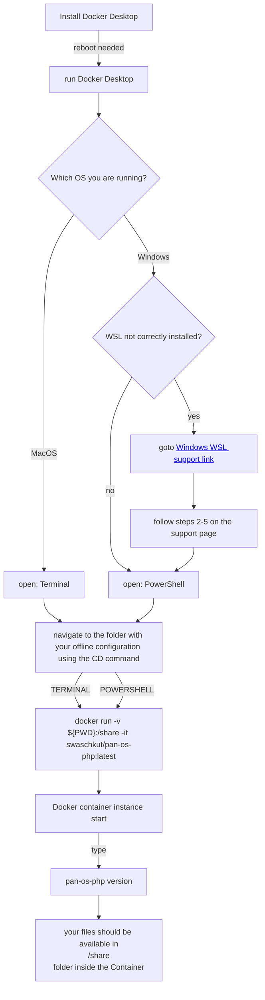

Deploy PAN-OS-PHP with Docker
===========


Windows Docker WSL installation check
===
[<a href='https://docs.microsoft.com/en-gb/windows/wsl/install-manual'>Windows WSL support link</a>]

["<a href='https://docs.microsoft.com/en-gb/windows/wsl/install-manual#step-3---enable-virtual-machine-feature' target='_blank' rel='noopener noreferrer'>Step 3 - Enable Virtual Machine feature</a>"]

["<a href='https://docs.microsoft.com/en-gb/windows/wsl/install-manual#step-4---download-the-linux-kernel-update-package' target='_blank' rel='noopener noreferrer'>Step 4 - Download the Linux kernel update package</a>"]

["<a href='https://docs.microsoft.com/en-gb/windows/wsl/install-manual#step-5---set-wsl-2-as-your-default-version' target='_blank' rel='noopener noreferrer'>Step 5 - Set WSL 2 as your default version</a>"]


#Additional Information

Docker build
============

There are Dockerfiles available with OS: Ubuntu20/22 and CentOS 7

For a quick start please use [WIKI docker](https://github.com/PaloAltoNetworks/pan-os-php/wiki/docker)


* **MacOS** : [run on MacOS terminal]
	```bash
	cd [pan-os-php Root folder]
	docker build -t pan-os-php -f docker/Dockerfile .
	cd [go to the Folder you like to share with the Container]
	docker run -v ${PWD}:/share -it pan-os-php
	```

* **WINDOWS** : [run on Windows terminal]
	```bash
	cd [pan-os-php Root folder]
	docker build -t pan-os-php -f docker/Dockerfile .
	cd [go to the Folder you like to share with the Container]
	docker run -v "%CD%":/share -it pan-os-php
	```


Docker PAN-OS-PHP API and UI
============
final production Container:
   ```bash
    cd [pan-os-php Root folder]
    docker build -t pan-os-php:latest -f docker/Dockerfile-API .
    docker run -d -p 8082:80 pan-os-php:latest
   ```
local Development Container:
   ```bash
   docker run -d -p 8082:80 --mount type=bind,source="[absolute_ROOTFOLDER]/pan-os-php",target=/var/www/html -v [absolute_ROOTFOLDER]/pan-os-php/var/docker/uploads.ini:/usr/local/etc/php/conf.d/uploads.ini php:apache
   ```

PAN-OS-PHP UI is available at: (which triggers next PAN-OS-PHP API)
   ```bash
   http://localhost:8082/utils/develop/ui
   ```
To get it working on your own PAN-OS Firewall / Panorama config files,
please upload your config files via PAN-OS-PHP UI (URL above)

It is also now possible to start using it with the previous uploaded file via PAN-OS-PHP API:
http://localhost:8082/utils/develop/api/v1/tool.php/address?in=YOUR_CONFIG_FILE.xml


The PAN-OS-PHP API is right now under development, but please feel free to try it out:
   ```bash
   http://localhost:8082/utils/develop/api/v1/tool.php
   ```

The following "RESTAPI" routes are available:
- /stats


- /address
- /service
- /tag
- /rule
- /securityprofile
- /securityprofilegroup
- /schedule

- /applicaton
- /threat

- /device


- /zone
- /interface
- /routing
- /virtualwire

- /key-manager

- /address-merger
- /addressgroup-merger
- /service-merger
- /servicegroup-merger
- /tag-merger
- /rule-merger

- /override-finder
- /diff
- /upload
- /xml-issue
- /appid-enabler
- /config-size
- /download-predefined
- /register-ip-mgr
- /userid-mgr
- /xml-op-json
- /bpa-generator

PAN-OS-PHP API is also working with PAN-OS XML API, therefor you need to prepare you Docker installation:
```bash
   API: http://localhost:8082/utils/develop/api/v1/tool.php/key-manager?&add=MGMTIP&user=USERNAME&pw=PASSWORD
   ```


Exmamples to run PAN-OS-PHP against PAN-OS FW and Panorama offline configuration files, and manipulate in the same way as on PAN-OS-PHP ClI:
   ```bash
   ClI: pan-os-php type=address help
   API: http://localhost:8082/utils/develop/api/v1/tool.php/address?help
   ```
   ```bash
   CLI: pan-os-php type=address listactions
   API: http://localhost:8082/utils/develop/api/v1/tool.php/address?listactions
   ```
